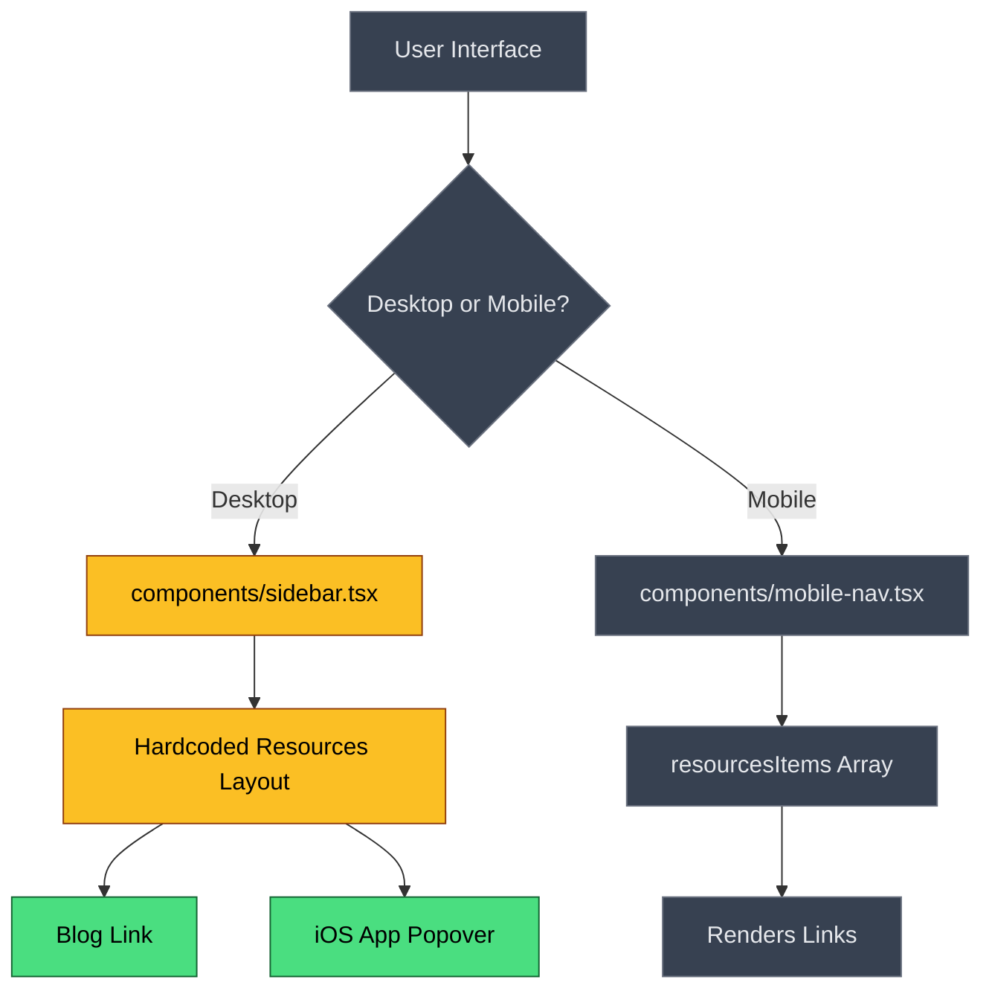
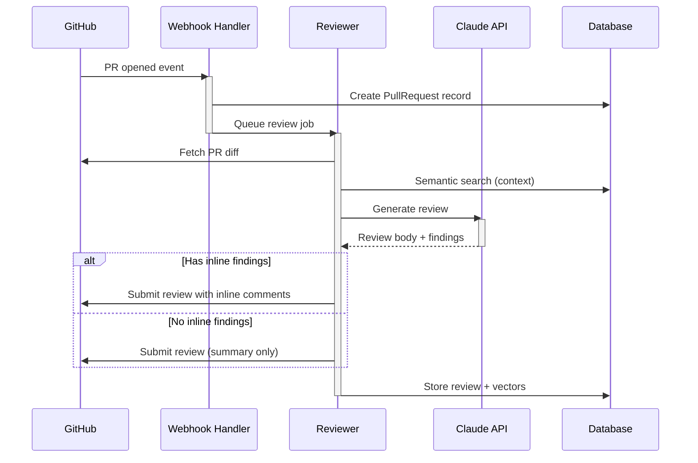
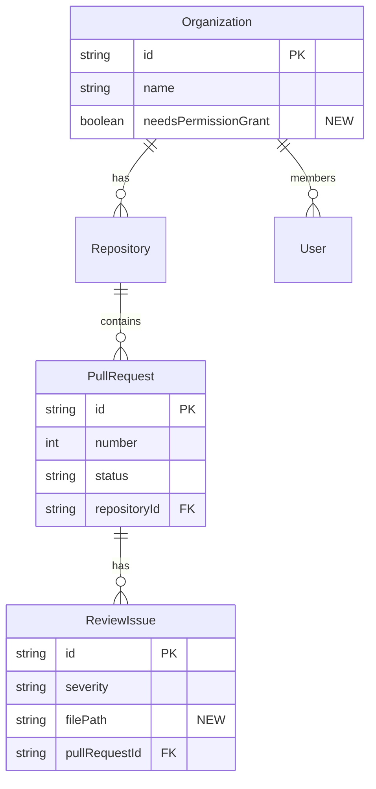
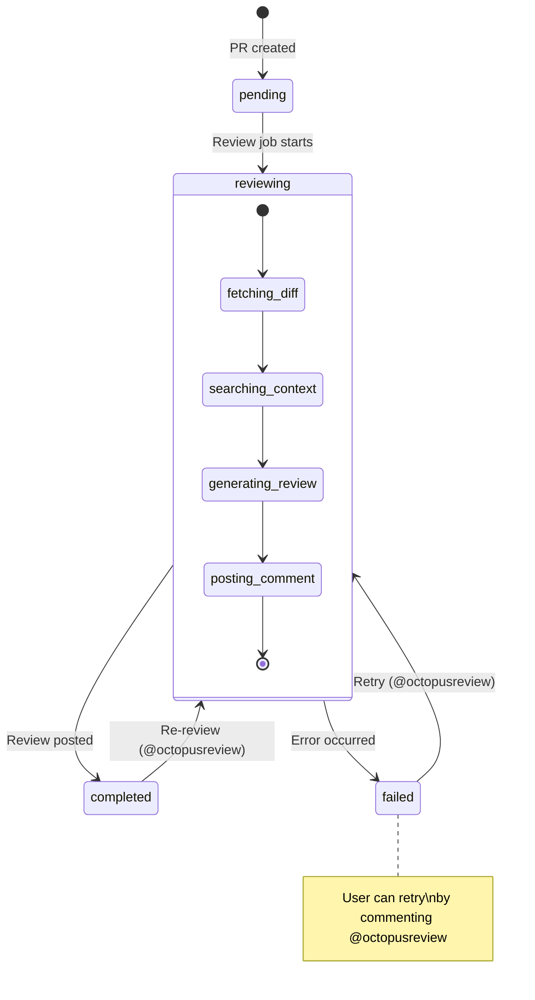

Include a Mermaid diagram ONLY when the PR contains meaningful code changes.
SKIP the diagram entirely for documentation-only PRs (README, markdown, comments,
config text, .env examples, changelog entries, license updates, etc.) — a diagram
adds no value when only prose or static config changed.

When a diagram IS warranted, include exactly ONE that best visualizes the changes.
Choose the diagram type based on the nature of the PR changes.

DIAGRAM TYPE SELECTION — Pick the BEST fit:

| PR Change Type | Diagram | When to Use |
|----------------|---------|-------------|
| UI components, conditional logic, file dependencies | **Flowchart** (`graph TD`) | Default for most PRs |
| API routes, webhook chains, multi-service communication | **Sequence Diagram** (`sequenceDiagram`) | 3+ actors/services interacting in sequence |
| Database schema, Prisma models, migrations | **ER Diagram** (`erDiagram`) | Schema/model/migration files changed |
| Status fields, lifecycle, state machines | **State Diagram** (`stateDiagram-v2`) | Status/state transitions added or modified |

If a PR spans multiple categories, choose the diagram type that represents the
MOST IMPORTANT aspect of the change. Do NOT combine multiple diagram types.

MERMAID SYNTAX RULES:

1. MANDATORY QUOTING: ALWAYS wrap ALL node labels in double quotes, regardless of content.
   This is the ONLY safe way to prevent Mermaid parse errors. No exceptions.
   ✅ `Build["builder.Build()"]`  ❌ `Build[builder.Build()]`
   ✅ `Page["Explore Page"]`      ❌ `Page[Explore Page]`
   Applies to all shapes: `["..."]`, `("...")`, `{"..."}`, `[("...")]`, `(("..."))`, `>"..."]`

2. FORBIDDEN CHARACTERS: NEVER use backticks (`) or semicolons (;) inside node labels.
   Backticks trigger markdown mode; semicolons are statement separators in Mermaid.
   Both cause parse errors. Use single quotes or commas instead.
   For double quotes inside labels, use `#quot;` (Mermaid HTML entity).

3. CLASS STATEMENTS (flowcharts ONLY):
   - `classDef` and `class` statements are ONLY valid in flowchart/graph diagrams.
     NEVER use them in sequenceDiagram, erDiagram, stateDiagram, or any other diagram type.
     They WILL cause parse errors in non-flowchart diagrams.
   - Each `class` statement MUST be on its OWN LINE — NEVER combine multiple class
     statements on one line. This is the #1 cause of Mermaid parse errors.
   - NO spaces after commas between node IDs: `class A,B,C style` NOT `class A, B, C style`
   - Use only the short node ID (the identifier before the shape bracket), never the label text.
   - Node IDs must be simple alphanumeric camelCase (no spaces, no special characters).
   - CRITICAL: Node IDs with spaces cause "got SPACE" parse errors. The display label goes
     in quotes inside brackets, but the ID itself MUST be a single camelCase word.
     ✅ `GoogleSignIn["Google Sign-In"]` then `class GoogleSignIn changed`
     ❌ `Google SignIn["Google Sign-In"]` then `class Google SignIn changed` ← PARSE ERROR
     ✅ `GitHubCard["GitHub Card"]` then `class GitHubCard changed`
     ❌ `GitHub Card["GitHub Card"]` then `class GitHub Card changed` ← PARSE ERROR
   ✅ Correct (each on its own line):
   ```
   class Sidebar,Resources changed
   class Blog,IOSApp added
   class UI,Decision unchanged
   ```
   ❌ WRONG (multiple on same line — causes parse error):
   ```
   class Sidebar,Resources changed class Blog,IOSApp added class UI,Decision unchanged
   ```

4. BLOCK CLOSURE — THIS IS THE #1 CAUSE OF BROKEN DIAGRAMS:
   The closing ``` MUST be on its OWN LINE with NOTHING after it.
   After the closing ```, you MUST add an EMPTY LINE before the next section.
   ✅ Correct (empty line between ``` and next heading):
   ```
       class A,B changed
       class C,D unchanged
   ```
   ← THIS EMPTY LINE IS MANDATORY
   ### Checklist
   ❌ WRONG — this WILL break the diagram:
   ```
       class A,B unchanged```### Checklist
   ```
   ❌ ALSO WRONG — no empty line:
   ```
       class A,B unchanged
   ```### Checklist

<!-- ============================== -->
<!-- SYNTAX QUICK REFERENCE         -->
<!-- ============================== -->

FLOWCHART NODE SHAPES:
- `[Text]` — Rectangle (default)
- `([Text])` — Stadium / rounded
- `[[Text]]` — Subroutine / double border
- `[(Text)]` — Cylindrical (database)
- `((Text))` — Circle
- `{Text}` — Rhombus / decision diamond
- `{{Text}}` — Hexagon
- `[/Text/]` — Parallelogram
- `>Text]` — Asymmetric / flag

FLOWCHART CONNECTION TYPES:
- `-->` — Arrow
- `---` — Line (no arrow)
- `-.->` — Dotted arrow
- `==>` — Thick arrow
- `-- "text" -->` — Arrow with label
- `-->|text|` — Arrow with label (alt)

FLOWCHART DIRECTIONS: `TD` (top-down), `LR` (left-right), `RL`, `BT`

SEQUENCE DIAGRAM MESSAGE TYPES:
- `->>` — Solid arrow (sync call)
- `-->>` — Dotted arrow (async response)
- `-x` — Solid with cross (failed)
- `--x` — Dotted with cross
- `-)` — Solid open arrow (async fire-and-forget)
- `--)` — Dotted open arrow
- Activation shorthand: `->>+` activates, `-->>-` deactivates

ER DIAGRAM CARDINALITY:
- `||--||` — One to one
- `||--o{` — One to zero-or-more
- `||--|{` — One to one-or-more
- `}o--o{` — Zero-or-more to zero-or-more
- `}|--|{` — One-or-more to one-or-more

STATE DIAGRAM EXTRAS:
- `state if_state <<choice>>` — Choice/decision node
- `state "Group" as grp { ... }` — Composite state
- `--` separator for concurrent regions
- `note right of State : text` — State note

<!-- ============================== -->
<!-- TYPE 1: FLOWCHART (default)    -->
<!-- ============================== -->

Use `graph TD` (top-down) for most diagrams, `graph LR` (left-right) for pipelines.

COLOR CODING (MANDATORY for flowcharts):
- 🟡 Yellow (#fbbf24): Files MODIFIED in this PR
- 🟢 Green (#4ade80): Files ADDED in this PR
- 🔴 Red (#f87171): Files DELETED in this PR
- ⬜ Gray dashed (#94a3b8, stroke-dasharray): Code TEMPORARILY HIDDEN / commented out
- 🟣 Purple (#818cf8): EXTERNAL services, APIs, third-party modules
- ⬛ Dark gray (#374151): UNCHANGED files shown for context

FLOWCHART DESIGN RULES:
1. Always include ALL files from the PR diff as nodes
2. Show the relationships between changed files (imports, calls, data flow)
3. Include 2-4 unchanged contextual nodes to show where changes fit in the system
4. Use decision diamonds for routing logic (e.g., "Desktop or Mobile?")
5. Group related nodes with subgraphs when there are 3+ related components
6. Mark temporarily hidden/commented-out code with dashed borders
7. Add brief labels on arrows to describe data flow: `-- "fetches data" -->`
8. Maximum 25 nodes per diagram
9. For UI changes: show component hierarchy (parent → children)
10. For API changes: show request flow (route → middleware → handler → service → db)

Flowchart Example:


<!-- ============================== -->
<!-- TYPE 2: SEQUENCE DIAGRAM       -->
<!-- ============================== -->

Use when the PR involves request/response flows between multiple actors or services.
Shows the TIME-ORDERED interactions between components.

SEQUENCE DIAGRAM RULES:
1. Actors/participants should represent distinct services, components, or external systems
2. Use `activate`/`deactivate` to show processing time
3. Use `alt`/`else` blocks for conditional branches
4. Use `loop` blocks for retry/polling logic
5. Use `note over` for important context
6. Keep it focused — max 8 participants, max 20 messages
7. NEVER add `classDef` or `class` statements — they are NOT supported in sequence diagrams and WILL cause parse errors

Sequence Diagram Example:


<!-- ============================== -->
<!-- TYPE 3: ER DIAGRAM             -->
<!-- ============================== -->

Use when the PR modifies database schema, Prisma models, or migration files.
Shows entity relationships and cardinality.

ER DIAGRAM RULES:
1. Include ALL models/tables that were added or modified in the PR
2. Include related unchanged models that have direct relationships
3. Show relationship cardinality: `||--o{` (one-to-many), `||--||` (one-to-one), `}o--o{` (many-to-many)
4. List only KEY fields (PK, FK, and fields changed in the PR) — not every column
5. Mark new fields/entities with comments
6. Maximum 12 entities per diagram
7. NEVER add `classDef` or `class` statements — they are NOT supported in ER diagrams

ER Diagram Example:


<!-- ============================== -->
<!-- TYPE 4: STATE DIAGRAM          -->
<!-- ============================== -->

Use when the PR adds or modifies status fields, state machines, or lifecycle flows.
Shows all possible states and valid transitions.

STATE DIAGRAM RULES:
1. Include ALL states defined in the code (enum values, status strings)
2. Show transitions with descriptive labels (what triggers the transition)
3. Use `[*]` for initial and final states
4. Use `state "..." as` for descriptive state names
5. Use `note` for important constraints
6. Group related states with `state "Group" as` blocks when needed
7. Mark NEW states/transitions added in this PR with `%% NEW` comments
8. NEVER add `classDef` or `class` statements — they are NOT supported in state diagrams
9. In `note` text and state descriptions: NEVER use parentheses `()` or extra colons `:` — they break the parser. Use dashes or plain text instead.

State Diagram Example:
